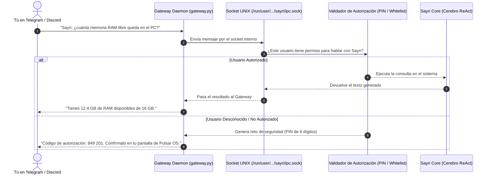

# 🔌 Channel Gateways: Guía Conceptual y Autorización

Un **Channel Gateway** es un puente que conecta Sayri con plataformas de mensajería externas como **Telegram**, **Discord**, **Matrix** o servidores **MCP**. 

Gracias a los Gateways, puedes interactuar con tu ordenador, tus subagentes o pedir tareas complejas directamente desde tu teléfono móvil o desde un canal de chat de tu equipo.

---

## 🧭 1. ¿Cómo Funciona un Gateway? (Paso a Paso)



---

## 🔐 2. Sistema de Autorización de Mensajes Entrantes

Para que nadie en internet pueda aprovecharse de tu bot y ejecutar cosas en tu ordenador o consumir tu cuota de IA, cada plugin declara cómo se autorizan los mensajes entrantes:

### 🟢 Modo 1: `pairing_otp` (Emparejamiento por PIN en el Escritorio)
* **Para qué sirve**: Cuando tienes un bot privado para ti en Telegram o Signal.
* **Cómo funciona**:
  1. La primera vez que le escribes a tu bot desde el móvil (`/start`), Sayri detecta que tu ID de Telegram es nueva.
  2. En tu pantalla de Pulsar OS aparece una notificación en **Sayri Cajita -> Plugins**:
     ```text
     El usuario @jaime (ID: 998231) quiere conectarse. PIN: 849 201. [Aprobar] [Rechazar]
     ```
  3. Si pulsas **Aprobar**, tu usuario queda guardado en `~/.config/sayri/authorizations.json` y ya puedes hablar con el bot para siempre.

---

### 🔵 Modo 2: `whitelist` (Lista Blanca de Usuarios o Roles)
* **Para qué sirve**: Para servidores de Discord de tu equipo de trabajo o canales privados.
* **Cómo funciona**:
  - En el archivo de configuración declaras los IDs de los usuarios autorizados (`allowed_users: ["123456789"]`) o los roles con permiso (`allowed_roles: ["Admin", "Developers"]`).
  - Si un usuario no autorizado intenta hablar con el bot, el mensaje se ignora automáticamente sin gastar tokens de IA ni procesar nada.

---

### 🟡 Modo 3: `public_support` (Canales Públicos con Aislamiento Total)
* **Para qué sirve**: Si quieres poner un subagente de soporte en un canal comunitario público de Discord (`#ayuda-pulsar`) al que cualquiera pueda preguntar.
* **Cómo funciona**:
  - El subagente se bloquea de forma obligatoria en **`LEVEL_0_NO_EXEC`** (es decir, **no tiene acceso a la terminal, ni a comandos bash ni a los archivos de tu ordenador**).
  - Se le aplica un límite de frecuencia (rate limit) de por ejemplo 5 preguntas por minuto por usuario para evitar abusos.

---

## 📄 3. Manifiesto del Gateway (`manifest.json`)

```json
{
  "id": "sayri-gateway-telegram",
  "name": "Telegram Bot Gateway",
  "version": "1.0.0",
  "author": "jaimegh-es",
  "description": "Puente de comunicación para Telegram con emparejamiento OTP y lista blanca.",
  "entrypoint": "gateway.py",
  "sandbox_level": "LEVEL_1_READONLY",
  "required_secrets": [
    "TELEGRAM_BOT_TOKEN"
  ],
  "authorization": {
    "mode": "pairing_otp",
    "allowed_users": ["@jaime"],
    "pairing_pin_required": true,
    "pin_expiration_seconds": 300,
    "rate_limit": {
      "max_requests_per_minute": 10,
      "burst": 3
    }
  }
}
```

---

## 🔌 4. Protocolo del Socket UNIX (`/run/user/<UID>/sayri/ipc.sock`)

El Gateway y Sayri se comunican mediante un socket local intercambiando paquetes en formato **JSON Lines (NDJSON)**:

1. **Mensaje Entrante (`INCOMING_MSG`)**:
   ```json
   {
     "type": "INCOMING_MSG",
     "session_id": "tg-9923841",
     "author_id": "992381",
     "author": "@jaime",
     "text": "¿Cómo instalo un paquete flatpak?"
   }
   ```
2. **Respuesta en Streaming (`DELTA`)**:
   ```json
   {
     "type": "DELTA",
     "session_id": "tg-9923841",
     "token": "Para instalar un flatpak usa: pulsar-store install..."
   }
   ```
3. **Respuesta Completada (`DONE`)**:
   ```json
   {
     "type": "DONE",
     "session_id": "tg-9923841",
     "full_text": "Para instalar un flatpak usa: pulsar-store install <id>"
   }
   ```
