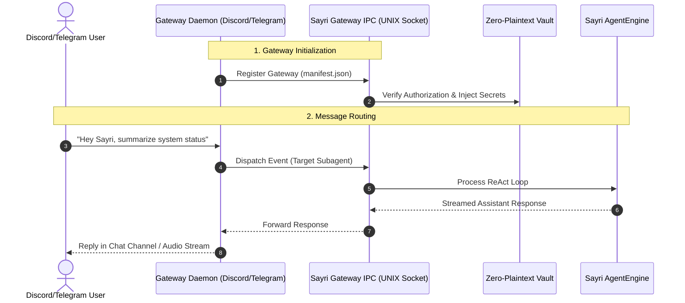

# 🔌 Channel Gateways & Plugin Authorization

A **Channel Gateway** in Sayri is an out-of-process daemon that connects Sayri's reasoning core to external communication platforms such as **Discord**, **Telegram**, **Matrix**, or **MCP (Model Context Protocol)** servers.

Gateways allow users or community members to interact with Sayri or its dedicated subagents directly from chat channels and voice rooms.

---

## 🏛️ 1. Gateway Architecture & IPC Communication



---

## 📄 2. Gateway Plugin Manifest (`manifest.json`)

Every Gateway plugin includes a `manifest.json` declaring its required permissions, required secrets, target subagent, and entrypoint:

```json
{
  "id": "sayri-gateway-telegram",
  "name": "Telegram Bot Gateway",
  "version": "1.0.0",
  "author": "jaimegh-es",
  "description": "Connects Sayri subagents to Telegram chat channels and private groups.",
  "entrypoint": "gateway.py",
  "target_agent_id": "default",
  "sandbox_level": "LEVEL_1_READONLY",
  "required_secrets": [
    "TELEGRAM_BOT_TOKEN"
  ],
  "capabilities": [
    "receive_messages",
    "send_replies",
    "voice_audio_stream"
  ],
  "allowed_domains": [
    "api.telegram.org"
  ]
}
```

---

## 🔐 3. How Plugin Authorization Works

To prevent unauthorized background network daemons from running on your machine:

1. **Step 1: Save Bot Credentials to Vault**
   - Open Sayri Cajita -> **Vault** tab (or run `sayri secrets set TELEGRAM_BOT_TOKEN <token>`).
   - The token is encrypted locally with AES using machine-derived keys (`/etc/machine-id` + UID).
2. **Step 2: Review and Authorize Plugin**
   - Open Sayri Cajita -> **Plugins** tab.
   - You will see the detected gateway plugin listed with its requested capabilities and sandbox level.
   - Click **Authorize / Enable**.
3. **Step 3: Sandboxed Spawning & Token Injection**
   - Sayri spawns the gateway entrypoint (`gateway.py`) inside a dedicated **Bubblewrap container** conforming to the manifest's `sandbox_level`.
   - The real `TELEGRAM_BOT_TOKEN` is injected strictly into the child process environment (`$TELEGRAM_BOT_TOKEN`).
   - The gateway communicates with Sayri via a secure local UNIX Domain Socket (`/run/user/<uid>/sayri/ipc.sock`).
