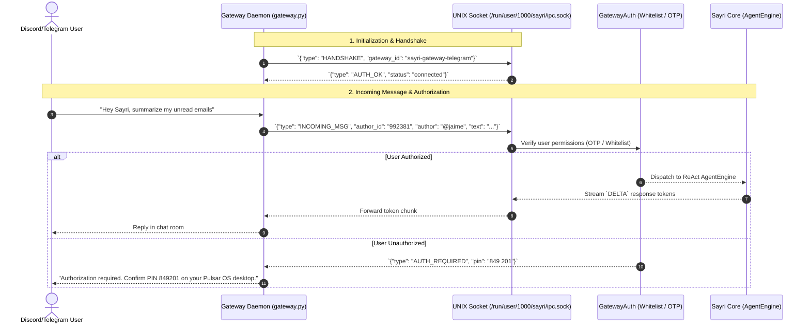

# Channel Gateways & Plugin Protocol Specification

A **Channel Gateway** in Sayri is an out-of-process background daemon that bridges Sayri's agentic core to external communication platforms (such as **Discord**, **Telegram**, **Matrix**, or **MCP (Model Context Protocol)** servers).

Gateways enable users, team channels, and external bots to send queries and voice audio directly to Sayri or to specialized subagents.

---

## 1. Gateway Architecture & IPC Communication



---

## 2. Unified Incoming Authorization System

To prevent unauthorized remote users from consuming AI tokens or triggering actions on your desktop, every gateway plugin specifies an **`authorization`** schema in its `manifest.json`.

Sayri enforces three distinct authorization modes:

### Mode A: `pairing_otp` (Interactive Desktop PIN Pairing)
Ideal for private 1-on-1 bots (such as personal Telegram or Signal bots):
- When an unknown user messages the bot (`/start` or `!pair`), Sayri generates an ephemeral 6-digit PIN.
- A notification banner appears in the desktop **Sayri Cajita -> Plugins** drawer:
  ```text
  Telegram user @jaime (ID: 998231) requests access. PIN: 849 201. [Approve] [Deny]
  ```
- Once approved, the user ID is permanently whitelisted in `~/.config/sayri/authorizations.json`.

### Mode B: `whitelist` (Declarative User & Role Filter)
Ideal for private team servers:
- Only messages matching explicit `allowed_users`, `allowed_roles`, or `allowed_guilds` are accepted.
- Non-whitelisted incoming messages are dropped or receive an immediate `403 Forbidden` response without invoking the LLM.

### Mode C: `public_support` (Public Sandboxed Community Subagents)
Ideal for public community Discord channels (`#ask-support`):
- Anyone in designated public channels can interact with the bot.
- **Enforcement**: Must be bound strictly to **`LEVEL_0_NO_EXEC`** (zero terminal/bash execution) with sliding-window rate limiting (e.g. max 5 queries per minute per user).

---

## 3. Gateway Plugin Manifest (`manifest.json`)

```json
{
  "id": "sayri-gateway-telegram",
  "name": "Telegram Bot Gateway",
  "version": "1.0.0",
  "author": "jaimegh-es",
  "description": "Connects Sayri subagents to Telegram chat channels with OTP pairing.",
  "entrypoint": "gateway.py",
  "target_agent_id": "default",
  "sandbox_level": "LEVEL_1_READONLY",
  "required_secrets": [
    "TELEGRAM_BOT_TOKEN"
  ],
  "authorization": {
    "mode": "pairing_otp",
    "allowed_users": ["@jaime"],
    "pairing_pin_required": true,
    "pin_expiration_seconds": 300,
    "rate_limit": {
      "max_requests_per_minute": 10,
      "burst": 3
    }
  },
  "capabilities": [
    "receive_messages",
    "send_replies",
    "voice_audio_stream"
  ],
  "allowed_domains": [
    "api.telegram.org"
  ]
}
```

---

## 4. UNIX Domain Socket IPC Protocol

All gateways communicate with Sayri via a local JSON-Lines (NDJSON) UNIX Domain Socket located at:
```text
/run/user/<UID>/sayri/ipc.sock
```

### Protocol Message Schemas:

#### 1. Handshake (`HANDSHAKE`)
```json
{
  "type": "HANDSHAKE",
  "gateway_id": "sayri-gateway-telegram",
  "manifest_version": "1.0.0"
}
```

#### 2. Incoming Message (`INCOMING_MSG`)
```json
{
  "type": "INCOMING_MSG",
  "session_id": "tg-chat-9923841",
  "author_id": "992381",
  "author": "jaime",
  "text": "What is the current RAM consumption?",
  "target_agent": "system-monitor"
}
```

#### 3. Authorization Challenge (`AUTH_CHALLENGE`)
```json
{
  "type": "AUTH_CHALLENGE",
  "session_id": "tg-chat-9923841",
  "status": "pending_desktop_pin",
  "pin_code": "849201"
}
```

#### 4. Stream Delta (`DELTA`)
```json
{
  "type": "DELTA",
  "session_id": "tg-chat-9923841",
  "token": "The current RAM usage is..."
}
```

#### 5. Stream Completion (`DONE`)
```json
{
  "type": "DONE",
  "session_id": "tg-chat-9923841",
  "full_text": "The current RAM usage is 2.4 GB out of 16 GB."
}
```

---

## 5. Complete Gateway Implementation Example (`gateway.py`)

```python
#!/usr/bin/env python3
"""Example Sayri Telegram Gateway Daemon with Unified Authorization."""
import os
import sys
import json
import socket

IPC_SOCKET_PATH = f"/run/user/{os.getuid()}/sayri/ipc.sock"

def main():
    token = os.environ.get("TELEGRAM_BOT_TOKEN")
    if not token:
        print("Error: TELEGRAM_BOT_TOKEN not provided by Sayri Vault.", file=sys.stderr)
        sys.exit(1)

    print("[Gateway] Connecting to Sayri IPC Socket...")
    client = socket.socket(socket.AF_UNIX, socket.SOCK_STREAM)
    client.connect(IPC_SOCKET_PATH)

    # 1. Send Handshake
    handshake = {
        "type": "HANDSHAKE",
        "gateway_id": "sayri-gateway-telegram",
        "manifest_version": "1.0.0"
    }
    client.sendall(json.dumps(handshake).encode('utf-8') + b'\n')

    print("[Gateway] Handshake complete. Gateway is active and enforcing authorization.")

if __name__ == "__main__":
    main()
```
