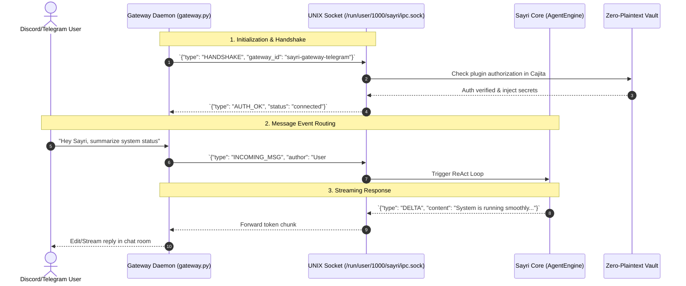

# 🔌 Channel Gateways & Plugin Protocol Specification

A **Channel Gateway** in Sayri is an out-of-process background daemon that bridges Sayri's agentic core to external communication platforms (such as **Discord**, **Telegram**, **Matrix**, or **MCP (Model Context Protocol)** servers).

Gateways enable users, team channels, and external bots to send queries and voice audio directly to Sayri or to specialized subagents.

---

## 🏛️ 1. Gateway Architecture & IPC Communication



---

## 📄 2. Gateway Manifest (`manifest.json`)

Every Gateway plugin includes a `manifest.json` declaring its required permissions, required secrets, target subagent, and entrypoint:

```json
{
  "id": "sayri-gateway-telegram",
  "name": "Telegram Bot Gateway",
  "version": "1.0.0",
  "author": "jaimegh-es",
  "description": "Connects Sayri subagents to Telegram chat channels and private groups.",
  "entrypoint": "gateway.py",
  "target_agent_id": "default",
  "sandbox_level": "LEVEL_1_READONLY",
  "required_secrets": [
    "TELEGRAM_BOT_TOKEN"
  ],
  "capabilities": [
    "receive_messages",
    "send_replies",
    "voice_audio_stream"
  ],
  "allowed_domains": [
    "api.telegram.org"
  ]
}
```

---

## 🔌 3. UNIX Domain Socket IPC Protocol

All gateways communicate with Sayri via a local JSON-Lines (NDJSON) UNIX Domain Socket located at:
```text
/run/user/<UID>/sayri/ipc.sock
```

### Supported Protocol Messages:

#### 1. Handshake (`HANDSHAKE`)
```json
{
  "type": "HANDSHAKE",
  "gateway_id": "sayri-gateway-telegram",
  "manifest_version": "1.0.0"
}
```

#### 2. Incoming Message (`INCOMING_MSG`)
```json
{
  "type": "INCOMING_MSG",
  "session_id": "tg-chat-9923841",
  "author": "jaime",
  "text": "¿Cuál es el consumo actual de memoria RAM?",
  "target_agent": "system-monitor"
}
```

#### 3. Stream Delta (`DELTA`)
```json
{
  "type": "DELTA",
  "session_id": "tg-chat-9923841",
  "token": "La memoria RAM utilizada actualmente es..."
}
```

#### 4. Stream Completion (`DONE`)
```json
{
  "type": "DONE",
  "session_id": "tg-chat-9923841",
  "full_text": "La memoria RAM utilizada actualmente es de 2.4 GB de 16 GB."
}
```

---

## 🐍 4. Complete Gateway Implementation Example (`gateway.py`)

Below is a Python implementation of an autonomous Gateway Daemon communicating with Sayri's UNIX socket:

```python
#!/usr/bin/env python3
"""Example Sayri Telegram Gateway Daemon."""
import os
import sys
import json
import socket

IPC_SOCKET_PATH = f"/run/user/{os.getuid()}/sayri/ipc.sock"

def main():
    token = os.environ.get("TELEGRAM_BOT_TOKEN")
    if not token:
        print("❌ Error: TELEGRAM_BOT_TOKEN not provided by Sayri Vault.", file=sys.stderr)
        sys.exit(1)

    print("[Gateway] Connecting to Sayri IPC Socket...")
    client = socket.socket(socket.AF_UNIX, socket.SOCK_STREAM)
    client.connect(IPC_SOCKET_PATH)

    # 1. Send Handshake
    handshake = {
        "type": "HANDSHAKE",
        "gateway_id": "sayri-gateway-telegram",
        "manifest_version": "1.0.0"
    }
    client.sendall(json.dumps(handshake).encode('utf-8') + b'\n')

    # 2. Listen for events or forward incoming messages
    print("[Gateway] Handshake complete. Gateway is active and listening.")

if __name__ == "__main__":
    main()
```

---

## 🔐 5. How Plugin Authorization Works in Sayri UI

To prevent rogue background daemons from running without your consent:

1. **Step 1: Save Bot Credentials to Vault**
   - Open Sayri Cajita -> **Vault** tab.
   - Enter `TELEGRAM_BOT_TOKEN` and paste your BotFather token.
   - Sayri encrypts it with AES using your machine hardware seed (`/etc/machine-id` + UID).
2. **Step 2: Review & Authorize Plugin**
   - Open Sayri Cajita -> **Plugins** tab.
   - You will see the detected gateway plugin listed with its requested capabilities (`receive_messages`, `send_replies`) and sandbox level (`LEVEL_1_READONLY`).
   - Click **Authorize / Enable**.
3. **Step 3: Sandboxed Execution**
   - Sayri spawns the gateway process inside an isolated **Bubblewrap jail**.
   - Injects `$SECRET:TELEGRAM_BOT_TOKEN` strictly into the child process environment.
   - The gateway communicates through `/run/user/<uid>/sayri/ipc.sock` without direct access to your desktop files.
