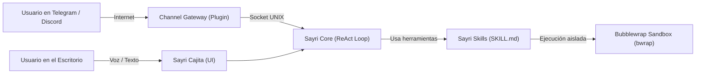
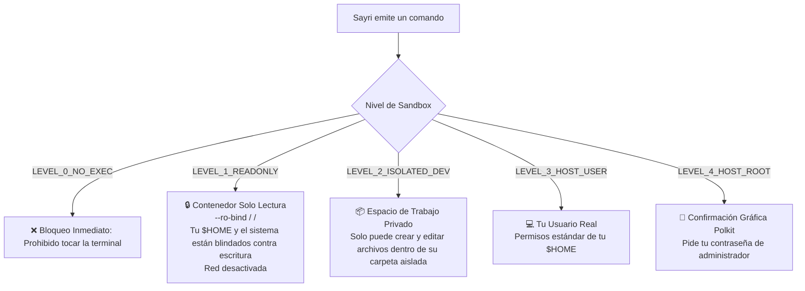

# 🤖 Sayri: Guía Conceptual y Arquitectura del Sistema

Sayri es el copiloto inteligente nativo de **Pulsar OS**. Su diseño está pensado para combinar la potencia de un modelo de lenguaje (LLM) con el control total, la seguridad y la privacidad de tu propio escritorio Linux.

---

## 💡 1. Entendiendo los Conceptos Clave (Explicado de Forma Directa)

Para entender cómo funciona Sayri, solo necesitas tener claros tres conceptos:



### 🧠 ¿Qué es una Skill (Habilidad)?
Imagina que Sayri viene de fábrica sabiendo razonar y hablar, pero no sabe cómo interactuar con programas específicos (como buscar en internet, inspeccionar código o mandar un mensaje a Discord).
* Una **Skill** es un paquete modular que contiene un archivo **`SKILL.md`** y varios scripts (en Python o Bash).
* En el `SKILL.md` le explicamos a Sayri: *"Cuando el usuario te pida buscar documentación, ejecuta este script `search.py` pasándole la consulta"*.
* **En resumen**: Una Skill le da **nuevas herramientas y conocimientos** a Sayri para que pueda realizar tareas concretas en tu equipo.

---

### 🔌 ¿Qué es un Channel Gateway (Plugin)?
Una Skill se usa cuando estás delante de tu ordenador usando la interfaz gráfica (**Cajita**). Pero, ¿qué pasa si estás fuera de casa y quieres consultar algo a Sayri desde tu móvil por **Telegram** o **Discord**?
* Un **Gateway** es un programa en segundo plano (demonio) que se conecta a tu bot de Telegram o Discord y hace de puente hacia Sayri.
* Cuando te llega un mensaje en Telegram, el Gateway se lo pasa a Sayri a través de un canal interno de comunicación ultra-rápido: un **Socket UNIX local** (`/run/user/<UID>/sayri/ipc.sock`).
* Sayri razona la respuesta, utiliza las Skills necesarias y le devuelve el texto en tiempo real al Gateway para que te lo mande a tu chat.
* **En resumen**: Un Gateway es un **puente de comunicación** para hablar con Sayri desde aplicaciones externas.

---

## 🛡️ 2. ¿Qué es Bubblewrap (`bwrap`) y Cómo Protege tu Ordenador?

Cuando Sayri o un subagente ejecuta código o herramientas de una Skill, **no lo hace directamente en tu sistema como si fuera tu usuario sin control**.

Sayri utiliza **Bubblewrap (`bwrap`)**, la misma tecnología que usan GNOME y Flatpak para aislar aplicaciones en Linux:



### ¿Por qué Bubblewrap es tan seguro?
1. **Sistema Raíz en Solo Lectura (`--ro-bind / /`)**: El subagente puede leer librerías (`python3`, `gcc`, `node`), pero **si intenta borrar o modificar `/etc`, `/usr` o tu carpeta personal `$HOME`, el kernel de Linux lo bloquea con `EROFS: Read-only file system`**.
2. **Espacio de Juego Aislado (`--bind sandboxes/<id>`)**: En el nivel `LEVEL_2_ISOLATED_DEV`, el subagente solo tiene permiso de escritura en su propia carpeta en `~/.local/share/sayri/sandboxes/<id>`.
3. **Aislamiento de Red (`--unshare-net`)**: Si la tarea no requiere internet, se desconecta el socket de red del contenedor para impedir fugas de información.
4. **Memoria Temporal Efímera (`--tmpfs /tmp`)**: Los archivos temporales se crean en la memoria RAM y desaparecen automáticamente al terminar el proceso.

---

## 🔒 3. Bóveda de Secretos Zero-Plaintext (Token Shield)

Para que tus claves privadas (como `DISCORD_BOT_TOKEN`, `TELEGRAM_BOT_TOKEN` o API keys) **NUNCA se envíen a los modelos de lenguaje (LLM)** ni aparezcan en el historial de chat:

1. Guardas el token en la pestaña **Vault** de Sayri Cajita.
2. Sayri lo cifra con AES usando claves derivadas del hardware de tu placa base (`/etc/machine-id` + UID).
3. Cuando el LLM genera el plan de acción, Sayri censura el token por una etiqueta opaca (ej: `$SECRET:TELEGRAM_BOT_TOKEN`).
4. Al arrancar el contenedor Bubblewrap, Sayri inyecta el valor real directamente en las variables de entorno del script. **El LLM nunca ve tu clave en texto plano**.

---

## 📂 4. Estructura de Directorios del Sistema

```text
/usr/share/sayri/lib/sayri/          # Librería central de Sayri
├── app.py                          # Bucle de aplicación GTK4 y servidor IPC
├── cajita.py                       # Interfaz gráfica Cajita (Entrada y Drawer)
├── domain/                         # Lógica del núcleo
│   ├── agent_engine.py             # Bucle de razonamiento ReAct
│   ├── secrets_manager.py          # Bóveda Zero-Plaintext
│   ├── agent_creator.py            # Creador de subagentes
│   └── skills_scanner.py           # Lector de SKILL.md
└── adapters/                       # Conexión con el sistema
    ├── sandbox/executor.py         # Ejecutor de Bubblewrap y Polkit
    └── storage/sqlite_sessions.py  # Base de datos SQLite (sayri.db)

~/.config/sayri/                    # Configuración de tu usuario
├── config.json                     # Preferencias generales
├── vault.json                      # Bóveda cifrada (Permisos 0600)
├── authorizations.json             # Lista de usuarios de Telegram/Discord autorizados
├── agents/                         # Perfiles de subagentes personalizados
└── skills/                         # Habilidades instaladas

~/.local/share/sayri/               # Estado en tiempo de ejecución
├── sayri.db                        # Base de datos SQLite de conversaciones
└── sandboxes/<agent_id>/           # Espacios de trabajo aislados de Bubblewrap
```
