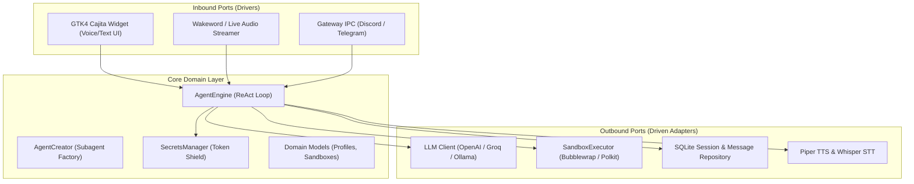
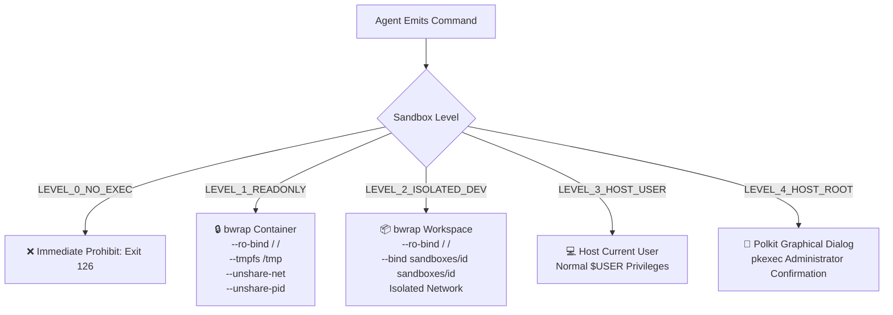

# 🤖 Sayri: Operating System AI Copilot & Architecture

Sayri is the native, agentic voice and text AI copilot designed specifically for **Pulsar OS**. It combines an Apple Intelligence-inspired GTK4 Cajita widget with a strictly decoupled hexagonal architecture, fine-grained **Bubblewrap (`bwrap`)** sandbox isolation, and a Zero-Plaintext Secrets Manager.

---

## 🏛️ 1. Hexagonal Architecture (Ports & Adapters)

Sayri is built on Ports and Adapters to separate the core reasoning loop from external operating system drivers and model providers:

### Key Architectural Components:
- **`sayri.cajita`**: The unified GTK4 overlay featuring an adaptive input pill with animated Chroma waves, responsive markdown rendering, and a multi-view settings drawer (`Chat`, `History`, `Agents`, `Plugins`, `Vault`).
- **`sayri.domain.agent_engine`**: Token-efficient ReAct agent orchestrator managing tool execution and state transitions.
- **`sayri.domain.secrets_manager`**: Zero-plaintext Token Shield preventing credentials from being leaked into LLM prompts.
- **`sayri.adapters.sandbox.executor`**: Granular sandbox runner implementing 5 distinct security isolation levels via Bubblewrap (`bwrap`).

---

## 📦 2. What is Bubblewrap (`bwrap`) and How Does it Protect You?

### ❓ What is Bubblewrap?
**Bubblewrap (`bwrap`)** is an unprivileged Linux container sandbox utility created by the GNOME and Flatpak teams. Unlike heavy container virtualization platforms like Docker, Bubblewrap:
1. **Requires NO Root Privileges & NO Background Daemons**: It uses standard unprivileged Linux kernel **Namespaces** (`user`, `pid`, `net`, `ipc`, `uts`, `mount`).
2. **Instant Microsecond Startup**: Spawns an isolated jail in under **5 milliseconds** with zero runtime overhead.
3. **Mount Point Manipulation**: Mounts existing host directories as **Strictly Read-Only** (`--ro-bind`) or memory-backed RAM tmpfs (`--tmpfs`).

### 🛡️ How Sayri Isolates Subagents with Bubblewrap:
- **Read-Only System Root (`--ro-bind / /`)**: Subagents can read shared system binaries (`python3`, `gcc`, `grep`, `node`), but **any write or delete operation to `/etc`, `/usr`, or your real `$HOME` immediately fails with `EROFS: Read-only file system`**.
- **Ephemeral Scratch Memory (`--tmpfs /tmp --tmpfs /run`)**: Temporary files are created in isolated memory and automatically destroyed when the subagent command terminates.
- **Private Playground (`--bind ~/.local/share/sayri/sandboxes/<id>`)**: In `LEVEL_2_ISOLATED_DEV`, the subagent has full write access ONLY within its designated sandbox directory.
- **Network Boundary (`--unshare-net`)**: Unshares the network namespace, preventing unauthorized outbound socket calls or telemetry leaks.
- **Process Shield (`--unshare-pid`)**: The subagent cannot see, inspect, or kill any other process running on your desktop.

---

### 📊 Summary of Sandbox Levels

| Sandbox Level | Filesystem Access | Network | Process Access | Typical Use Case |
| :--- | :--- | :--- | :--- | :--- |
| **`LEVEL_0_NO_EXEC`** | No execution allowed | Disabled | None | Public Discord bots, support assistants |
| **`LEVEL_1_READONLY`** | Read-Only (`/`), ephemeral `/tmp` | Disabled (`--unshare-net`) | Isolated PID | Code reading, syntax checking |
| **`LEVEL_2_ISOLATED_DEV`** | Read-Only system, write in `sandboxes/<id>` | Configurable | Isolated PID | Safe code generation, test compilers |
| **`LEVEL_3_HOST_USER`** | Current User `$HOME` | Host Network | User Processes | Desktop automation, opening apps |
| **`LEVEL_4_HOST_ROOT`** | Full System (Elevated) | Host Network | Root / System | Package installation, hardware management |

---

## 🔒 3. Zero-Plaintext Secrets Manager & Token Shield

To guarantee user privacy and avoid exfiltrating sensitive tokens to third-party LLM providers:

1. **Local Key Vault**: Credentials are saved in `~/.config/sayri/vault.json` (mode `0600`), encrypted using hardware and machine-derived seeds (`/etc/machine-id` + UID).
2. **Prompt Redaction**: When user prompts or terminal outputs contain sensitive keys, `SecretsManager.sanitize_text_for_llm()` redacts them into opaque placeholders (e.g. `$SECRET:DISCORD_BOT_TOKEN`).
3. **Child Process Injection**: Real values are injected solely into the child process environment (`env=secrets_manager.inject_environment()`). The LLM **never sees the raw secret in plaintext**.

---

## 🌌 4. Pulsar Store Integration

Sayri skills and plugins are packaged and distributed through the **Pulsar Store** (`https://github.com/Inled-Pulsar-OS/store`). Every package is audited by **OpenCode (Groq Llama 3.3 70B)** and scanned with **VirusTotal API** before publication.
