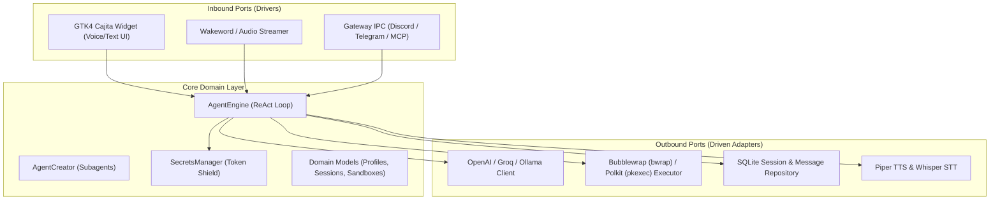

# 🤖 Sayri: Operating System AI Assistant & Copilot

Sayri is the native, agentic voice & text AI assistant built specifically for **Pulsar OS Pear Edition**. It combines an Apple Intelligence / Siri-inspired GTK4 UI with a strictly isolated hexagonal architecture, fine-grained Bubblewrap (`bwrap`) sandboxing, and a Zero-Plaintext Secrets Manager.

---

## 🏛️ 1. Hexagonal Architecture (Ports & Adapters)

Sayri is engineered with strict decoupling between the domain core, ports, and infrastructure adapters:

### Key Modules:
- **`sayri.cajita`**: The unified GTK4 widget featuring a top input pill with Apple Intelligence glowing borders, and a bottom response card with a multi-view stack (`Chat`, `History`, `Agents`, `Plugins`, `Vault`).
- **`sayri.domain.agent_engine`**: Token-efficient ReAct agent orchestrator managing tool execution and state transitions.
- **`sayri.domain.secrets_manager`**: Zero-plaintext Token Shield preventing credentials from being exposed in LLM prompts.
- **`sayri.adapters.sandbox.executor`**: Granular sandbox runner implementing 5 distinct security isolation levels.

---

## 🔒 2. Zero-Plaintext Secrets Manager & Token Shield

To guarantee user privacy and avoid exfiltrating sensitive tokens to third-party LLM providers:

1. **Local AES/Machine-Derived Key Vault**: Secrets are stored in `~/.config/sayri/vault.json` with permissions `0600`, encrypted using machine-specific seeds (`/etc/machine-id` + UID).
2. **Prompt Redaction (Token Shield)**: When user messages or tool outputs contain registered keys, the `SecretsManager.sanitize_text_for_llm()` method automatically redacts them into placeholder tokens (e.g. `$SECRET:DISCORD_BOT_TOKEN`, `$SECRET:TELEGRAM_TOKEN`).
3. **Execution Injection**: When a tool, script, or plugin runs inside a `bwrap` container, real values are injected strictly into the child process environment variables (`env=secrets_manager.inject_environment()`). The LLM **never sees the raw secret**.

---

## 🛡️ 3. Subagent Sandbox Levels

Sayri supports creating autonomous subagents with fine-grained sandbox restrictions:

| Sandbox Level | Restrictions & Permissions | Primary Use Case |
| :--- | :--- | :--- |
| `LEVEL_0_NO_EXEC` | Pure conversational mode. All shell commands and filesystem write operations are strictly blocked. | Public Discord bots, Customer Support agents. |
| `LEVEL_1_READONLY` | Read-only system filesystem (`--ro-bind / /`), ephemeral `/tmp`, unshared PID/IPC/network namespaces. | Code analysis, documentation searching. |
| `LEVEL_2_ISOLATED_DEV` | Isolated workspace directory (`~/.local/share/sayri/sandboxes/<id>`), isolated network. | Safe code generation, compiler testing. |
| `LEVEL_3_HOST_USER` | Standard user privileges (`$HOME`). Commands run as the active desktop user. | Daily desktop automation, opening apps, taking screenshots. |
| `LEVEL_4_HOST_ROOT` | Elevated privileges via Polkit graphical confirmation (`pkexec`). | System updates, package installations, hardware management. |

---

## 🔌 4. Channel Gateways & Plugins

Sayri interacts with external services through out-of-process sandboxed daemons:
- **Discord Gateway**: Bridges Sayri voice and text to Discord channels.
- **Telegram Bot**: Bridges chat messages to dedicated subagents.
- **Model Context Protocol (MCP)**: Standardized JSON-RPC protocol for local tool discovery.

---

## 🌌 5. Pulsar Store Integration

Sayri skills and plugins are packaged and distributed through the **Pulsar Store** (`https://github.com/pulsar-os/store`). Every package is audited by **OpenCode (Groq Llama 3.3 70B)** and scanned with **VirusTotal API** before publication.
