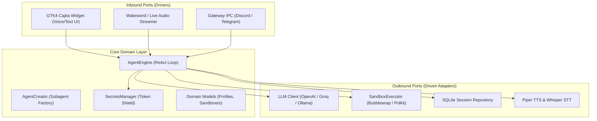
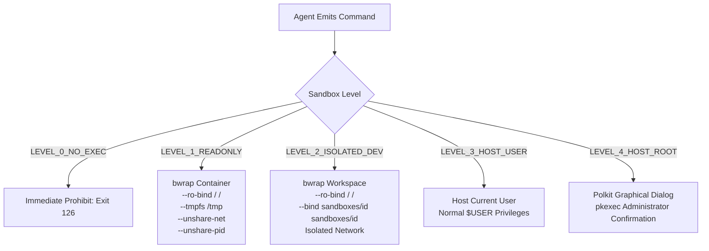
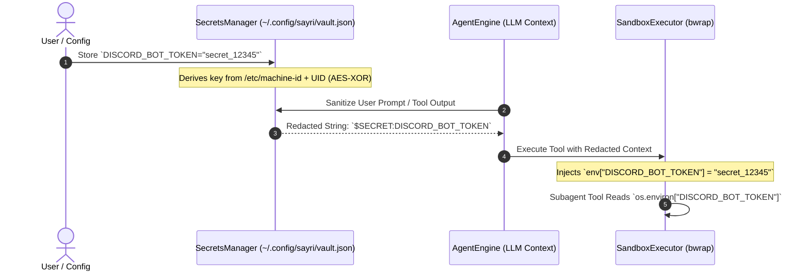

# Sayri: Operating System AI Copilot & Core Architecture

Sayri is the native, agentic voice and text AI copilot engineered specifically for **Pulsar OS**. It is architected from the ground up using **Hexagonal Architecture (Ports and Adapters)**, providing strict isolation between the reasoning loop, the local operating system, external LLM providers, and desktop UI components.

---

## 1. System Overview & Directory Layout

Sayri's runtime files, binaries, persistent databases, and configuration directories are structured as follows:

```text
/usr/share/sayri/lib/sayri/          # Core Python library package
├── app.py                          # GTK4 Application lifecycle & IPC streamer
├── cajita.py                       # Unified Cajita UI Overlay (Input Pill & Response Deck)
├── orb.py                          # Animated Chroma glow wave renderer
├── audio.py                        # Audio stream capture & playback pipeline
├── stt.py                          # Whisper STT offline / local speech transcriber
├── tts.py                          # Piper neural text-to-speech engine
├── wakeword.py                     # OpenWakeWord background listener ("Hey Sayri")
├── config.py                       # User configuration manager
├── domain/                         # Core Domain Logic (Zero dependencies on UI/OS)
│   ├── models.py                   # Dataclasses: AgentProfile, Session, Message, SandboxConfig
│   ├── agent_engine.py             # ReAct loop orchestrator & tool execution dispatcher
│   ├── agent_creator.py            # Subagent factory & natural language parser
│   ├── secrets_manager.py          # Zero-Plaintext Token Shield (AES-XOR Hardware Vault)
│   ├── skills_scanner.py           # SKILL.md filesystem scanner & YAML frontmatter parser
│   └── triggers.py                 # Cron schedules and file watcher triggers
└── adapters/                       # Infrastructure Adapters (Drivers & Driven)
    ├── sandbox/executor.py         # Bubblewrap (bwrap) & Polkit (pkexec) container runner
    └── storage/sqlite_sessions.py  # SQLite persistent session repository (WAL Mode)

~/.config/sayri/                    # User configuration & vault
├── config.json                     # Main configuration (Audio mode, active profile, shortcuts)
├── vault.json                      # Encrypted credentials store (Permissions 0600)
├── agents/                         # Custom subagent JSON profiles
└── skills/                         # User-installed custom skills & tools

~/.local/share/sayri/               # Runtime state & storage
├── sayri.db                        # SQLite database (Sessions, messages, tool execution logs)
└── sandboxes/<agent_id>/           # Private isolated workspace directories for Bubblewrap
```

---

## 2. Hexagonal Architecture (Ports & Adapters)



### Core Domain Components:
- **`AgentEngine`** (`domain/agent_engine.py`): Token-efficient orchestrator implementing the ReAct pattern. It formats system prompts, evaluates user queries, dispatches tool calls to the sandbox executor, and streams output tokens.
- **`SecretsManager`** (`domain/secrets_manager.py`): Zero-Plaintext credential shield that prevents API keys and bot tokens from entering LLM prompts or chat history.
- **`AgentCreator`** (`domain/agent_creator.py`): Subagent profile generator supporting JSON configuration files and automated natural language provisioning (e.g. *"Create a Discord bot subagent"*).
- **`SQLiteSessionRepository`** (`adapters/storage/sqlite_sessions.py`): Persistent chat memory utilizing SQLite with Write-Ahead Logging (WAL) and foreign-key constraints.

---

## 3. What is Bubblewrap (`bwrap`) & How Does it Work?

**Bubblewrap (`bwrap`)** is an unprivileged Linux sandboxing utility originally developed by the GNOME and Flatpak teams. It allows creating lightweight, ephemeral execution environments using standard Linux kernel **Namespaces** (`user`, `pid`, `net`, `ipc`, `uts`, `mount`) without requiring root access, setuid binaries, or background system daemons.



### Bubblewrap Command Construction in `SandboxExecutor`:

When executing a tool in `LEVEL_1_READONLY` or `LEVEL_2_ISOLATED_DEV`, `SandboxExecutor` builds the container arguments:

```bash
bwrap \
  --ro-bind / / \
  --dev /dev \
  --proc /proc \
  --tmpfs /tmp \
  --tmpfs /run \
  --bind ~/.local/share/sayri/sandboxes/<agent_id> ~/.local/share/sayri/sandboxes/<agent_id> \
  --chdir ~/.local/share/sayri/sandboxes/<agent_id> \
  --die-with-parent \
  --unshare-pid \
  --unshare-ipc \
  --unshare-uts \
  --unshare-net \
  -- bash -c "<command>"
```

### Protection Mechanics:
1. **Read-Only Host (`--ro-bind / /`)**: Mounts the entire host root as read-only. Subagents can execute compiler and runtime binaries (`python3`, `gcc`, `node`, `grep`), but **any write or delete attempt to `/etc`, `/usr`, `/var` or the user's `$HOME` directory is intercepted and blocked by the Linux kernel with `EROFS: Read-only file system`**.
2. **Ephemeral Memory (`--tmpfs /tmp --tmpfs /run`)**: Creates ephemeral in-memory filesystems for temporary allocations that are destroyed upon process exit.
3. **Network Isolation (`--unshare-net`)**: Unshares the network namespace, preventing unauthorized socket communication, telemetry exfiltration, or external downloads.
4. **PID Isolation (`--unshare-pid`)**: Isolate process IDs so the subagent cannot view, trace, or signal host desktop processes.

---

## 4. Sandbox Isolation Levels

| Level | Filesystem Access | Network | Process Access | Typical Use Case |
| :--- | :--- | :--- | :--- | :--- |
| **`LEVEL_0_NO_EXEC`** | Execution Prohibited | Disabled | None | Public Discord bots, support assistants |
| **`LEVEL_1_READONLY`** | Read-Only (`/`), ephemeral `/tmp` | Disabled (`--unshare-net`) | Isolated PID | Code reading, documentation queries |
| **`LEVEL_2_ISOLATED_DEV`** | Read-Only system, write in `sandboxes/<id>` | Configurable | Isolated PID | Code generation, compilation testing |
| **`LEVEL_3_HOST_USER`** | Current User `$HOME` | Host Network | User Processes | Desktop automation, launching apps |
| **`LEVEL_4_HOST_ROOT`** | Full System (Elevated) | Host Network | Root / System | Package updates, system configuration |

---

## 5. Zero-Plaintext Secrets Manager (AES-XOR Vault)

To ensure third-party LLM providers never receive credentials in plaintext:



1. **Hardware-Derived Key**: The encryption key is derived via SHA-256 over a composite seed:
   $$\text{Key} = \text{SHA256}(\text{"sayri-zero-plaintext-vault"} + \text{read}(\text{/etc/machine-id}) + \text{UID})$$
2. **Prompt Redaction**: When user prompts or tool outputs contain registered tokens, `SecretsManager.sanitize_text_for_llm()` automatically replaces the raw value with `$SECRET:<KEY_NAME>`.
3. **Process Injection**: When spawning child processes inside `bwrap`, `SecretsManager.inject_environment()` supplies real values strictly via process environment variables (`env=...`).

---

## 6. SQLite Storage Schema (`sayri.db`)

Chat history, subagent states, and tool execution logs are stored in `~/.local/share/sayri/sayri.db` configured with `PRAGMA journal_mode=WAL;`.

```sql
CREATE TABLE IF NOT EXISTS sessions (
    id TEXT PRIMARY KEY,
    title TEXT NOT NULL,
    agent_id TEXT NOT NULL DEFAULT 'default',
    created_at REAL NOT NULL,
    updated_at REAL NOT NULL,
    token_usage INTEGER DEFAULT 0,
    metadata TEXT DEFAULT '{}'
);

CREATE TABLE IF NOT EXISTS messages (
    id INTEGER PRIMARY KEY AUTOINCREMENT,
    session_id TEXT NOT NULL,
    role TEXT NOT NULL, -- 'system', 'user', 'assistant', 'tool'
    content TEXT NOT NULL,
    tool_call_id TEXT,
    timestamp REAL NOT NULL,
    metadata TEXT DEFAULT '{}',
    FOREIGN KEY(session_id) REFERENCES sessions(id) ON DELETE CASCADE
);

CREATE TABLE IF NOT EXISTS tool_calls (
    id TEXT PRIMARY KEY,
    message_id INTEGER,
    name TEXT NOT NULL,
    arguments TEXT NOT NULL,
    status TEXT NOT NULL, -- 'pending', 'running', 'success', 'denied', 'failed'
    output TEXT,
    exit_code INTEGER,
    duration_ms REAL DEFAULT 0.0,
    created_at REAL NOT NULL,
    FOREIGN KEY(message_id) REFERENCES messages(id) ON DELETE CASCADE
);
```

---

## 7. Audio & Speech Pipeline

1. **Voice Activity & Wakeword Detection** (`wakeword.py`):
   - Uses **OpenWakeWord** with an 80ms audio frame buffer running on CPU.
   - Detects *"Hey Sayri"* and activates the Cajita GTK4 interface.
2. **Speech-to-Text (STT)** (`stt.py`):
   - Uses **Faster-Whisper** (quantized `base.en` / `small`) running locally via ONNX Runtime.
3. **Text-to-Speech (TTS)** (`tts.py`):
   - Uses **Piper Neural TTS** with low-latency streaming audio playback via PulseAudio / PipeWire.
