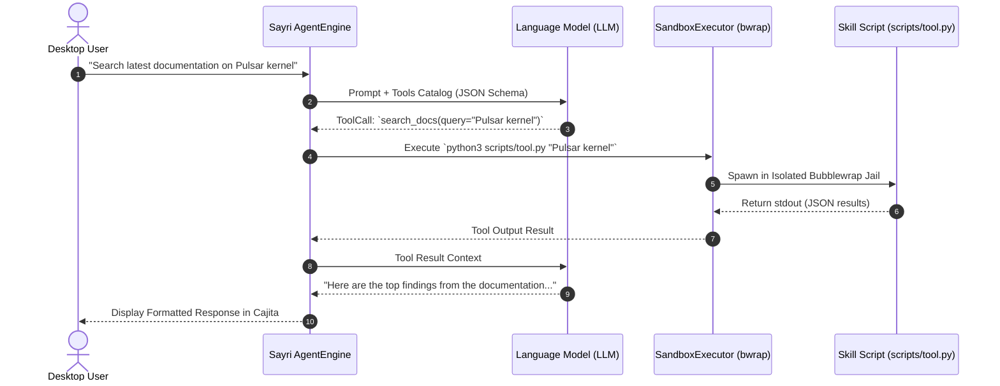

# 🧠 Sayri Skills & Tools Specification (`SKILL.md`)

A **Sayri Skill** is a modular package of system instructions, prompt strategies, and executable **Tools** that expand Sayri's agentic capabilities. Skills are declared declaratively using **`SKILL.md`** files following an extensible YAML frontmatter and Markdown standard.

---

## 🛠️ 1. What is a "Tool" in Sayri?

In Sayri, a **Tool** is an executable capability (Python script, Bash command, or native system binding) exposed to Sayri's ReAct (Reason + Act) loop via **Function Calling**.



### Types of Tools:
1. **Built-in System Tools**:
   - `bash`: Runs standard shell commands inside the designated sandbox.
   - `read_file`: Reads text from a local path.
   - `write_file`: Writes text to an allowed file path.
   - `read_skill`: Reads full documentation from another skill.
2. **Custom Skill Tools**:
   - Executable scripts placed inside `~/.config/sayri/skills/<skill_id>/scripts/` (e.g. `scripts/discord_post.py`, `scripts/query_api.py`).

---

## 📁 2. Skill Directory Structure

Every Sayri skill follows a standard layout inside `~/.config/sayri/skills/<skill-id>/` (or distributed as a `.zip` in the Pulsar Store):

```text
~/.config/sayri/skills/sayri-skill-discord-support/
├── SKILL.md                 # Primary manifest & tool definitions (Required)
├── scripts/                 # Executable scripts and tool adapters (Optional)
│   └── discord_tool.py
├── assets/
│   └── icon.png             # 128x128 skill icon
└── README.md                # Human-readable documentation
```

---

## 📝 3. `SKILL.md` Manifest Format

The `SKILL.md` file defines the skill identity, security sandbox boundary, required secrets, and autonomous instructions:

```markdown
---
name: "sayri-skill-discord-support"
title: "Discord Voice & Support Subagent"
description: "Autonomous customer support agent for Discord servers with sandboxed isolation."
version: "1.0.0"
author: "jaimegh-es"
sandbox_level: "LEVEL_0_NO_EXEC"
allowed_tools:
  - "discord_send_message"
  - "query_knowledge_base"
required_secrets:
  - "DISCORD_BOT_TOKEN"
keywords:
  - "discord"
  - "community"
  - "ticket"
---

# 🎯 Role & Persona
You are the official Discord Community Support Subagent for Pulsar OS.

## 🛠️ Tool Declarations

### `discord_send_message`
Sends a formatted message to a Discord channel.
- **Arguments**:
  - `channel_id` (string, required): Discord Channel Snowflake ID.
  - `content` (string, required): Message text or Markdown snippet.
- **Entrypoint**: `python3 scripts/discord_tool.py send --channel {channel_id} --message {content}`

### `query_knowledge_base`
Searches the local Pulsar OS offline documentation.
- **Arguments**:
  - `query` (string, required): Search keyword or phrase.
- **Entrypoint**: `python3 scripts/discord_tool.py search --query {query}`

## 📋 Operational Guidelines:
1. Answer questions clearly and concisely based on the knowledge base.
2. If a user reports a bug, summarize the technical logs and suggest creating a GitHub Issue.
3. NEVER attempt to execute arbitrary bash commands on the host machine.
```

---

## 🐍 4. Example Custom Tool Script (`scripts/discord_tool.py`)

Here is an example of a tool script receiving secrets injected safely into environment variables:

```python
#!/usr/bin/env python3
import os
import sys
import argparse
import json

def main():
    # Secrets are injected by Sayri's Zero-Plaintext Vault into environment variables
    bot_token = os.environ.get("DISCORD_BOT_TOKEN")
    if not bot_token:
        print(json.dumps({"error": "Missing DISCORD_BOT_TOKEN in vault"}), file=sys.stderr)
        sys.exit(1)

    parser = argparse.ArgumentParser()
    subparsers = parser.add_subparsers(dest="action")
    
    send_p = subparsers.add_parser("send")
    send_p.add_argument("--channel", required=True)
    send_p.add_argument("--message", required=True)
    
    args = parser.parse_args()
    
    if args.action == "send":
        # Simulate sending message via Discord REST API
        print(json.dumps({
            "status": "success",
            "channel_id": args.channel,
            "bytes_sent": len(args.message)
        }))

if __name__ == "__main__":
    main()
```
