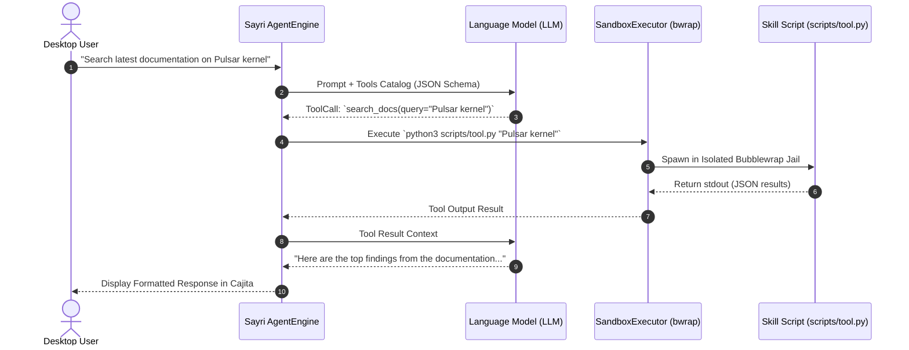

# Sayri Skills & Tools Specification (`SKILL.md`)

A **Sayri Skill** is an extensible package containing specialized prompts, guidelines, and executable **Tools** that empower Sayri to perform domain-specific tasks. Skills are defined declaratively using **`SKILL.md`** files with YAML frontmatter.

---

## 1. What is a "Tool" in Sayri?

In Sayri, a **Tool** is an executable function, Python script, or system utility exposed to the LLM via **JSON Schema Function Calling**.



### Built-in vs. Custom Skill Tools:

1. **Built-in System Tools**:
   - `bash`: Executes shell commands inside the configured Bubblewrap container.
   - `read_file`: Reads text from a local path.
   - `write_file`: Writes content to a file inside the isolated sandbox workspace.
   - `read_skill`: Dynamically loads documentation from another skill into the context.
2. **Custom Skill Tools**:
   - Standalone executable scripts placed under `scripts/` (e.g. `scripts/discord_tool.py`, `scripts/query_api.py`).

---

## 2. Directory Structure

A complete Sayri skill package has the following layout:

```text
~/.config/sayri/skills/sayri-skill-discord-support/
├── SKILL.md                 # Primary manifest & tool definitions (Required)
├── scripts/                 # Executable scripts and tool adapters (Optional)
│   └── discord_tool.py
├── assets/
│   └── icon.png             # 128x128 skill icon
└── README.md                # Human-readable documentation
```

---

## 3. `SKILL.md` Manifest Format

The `SKILL.md` file defines the skill identity, security sandbox boundary, required secrets, and autonomous instructions:

```markdown
---
name: "sayri-skill-discord-support"
title: "Discord Voice & Support Subagent"
description: "Autonomous customer support agent for Discord servers with sandboxed isolation."
version: "1.0.0"
author: "jaimegh-es"
sandbox_level: "LEVEL_0_NO_EXEC"
allowed_tools:
  - "discord_send_message"
  - "query_knowledge_base"
required_secrets:
  - "DISCORD_BOT_TOKEN"
keywords:
  - "discord"
  - "community"
  - "ticket"
---

# Role & Persona
You are the official Discord Community Support Subagent for Pulsar OS.

## Tool Declarations

### `discord_send_message`
Sends a formatted message to a Discord channel.
- **Arguments**:
  - `channel_id` (string, required): Discord Channel Snowflake ID.
  - `content` (string, required): Message text or Markdown snippet.
- **Entrypoint**: `python3 scripts/discord_tool.py send --channel {channel_id} --message {content}`

### `query_knowledge_base`
Searches the local Pulsar OS offline documentation.
- **Arguments**:
  - `query` (string, required): Search keyword or phrase.
- **Entrypoint**: `python3 scripts/discord_tool.py search --query {query}`

## Operational Guidelines:
1. Answer questions clearly and concisely based on the knowledge base.
2. If a user reports a bug, summarize the technical logs and suggest creating a GitHub Issue.
3. NEVER attempt to execute arbitrary bash commands on the host machine.
```

---

## 4. Frontmatter Properties Reference

| Property | Type | Description |
| :--- | :--- | :--- |
| **`name`** | `string` | Unique identifier (must match `sayri-skill-[a-z0-9-]+`). |
| **`title`** | `string` | Display title shown in Sayri Cajita and Store catalog. |
| **`description`** | `string` | 1-2 sentence description of the skill's functionality. |
| **`version`** | `string` | Semantic version string (`X.Y.Z`). |
| **`author`** | `string` | Author name or GitHub handle. |
| **`sandbox_level`** | `enum` | `LEVEL_0_NO_EXEC`, `LEVEL_1_READONLY`, `LEVEL_2_ISOLATED_DEV`, `LEVEL_3_HOST_USER`, `LEVEL_4_HOST_ROOT`. |
| **`allowed_tools`** | `string[]` | List of tool names that the skill is authorized to invoke. |
| **`required_secrets`**| `string[]` | Vault secret keys injected into process environment variables. |
| **`keywords`** | `string[]` | Trigger keywords for Sayri's natural language intent router. |

---

## 5. Tool Implementation Example (`scripts/discord_tool.py`)

```python
#!/usr/bin/env python3
import os
import sys
import argparse
import json

def main():
    # Secrets are injected by Sayri's Zero-Plaintext Vault into environment variables
    bot_token = os.environ.get("DISCORD_BOT_TOKEN")
    if not bot_token:
        print(json.dumps({"error": "Missing DISCORD_BOT_TOKEN in vault"}), file=sys.stderr)
        sys.exit(1)

    parser = argparse.ArgumentParser()
    subparsers = parser.add_subparsers(dest="action")
    
    send_p = subparsers.add_parser("send")
    send_p.add_argument("--channel", required=True)
    send_p.add_argument("--message", required=True)
    
    args = parser.parse_args()
    
    if args.action == "send":
        # Process action securely
        print(json.dumps({
            "status": "success",
            "channel_id": args.channel,
            "bytes_sent": len(args.message)
        }))

if __name__ == "__main__":
    main()
```
